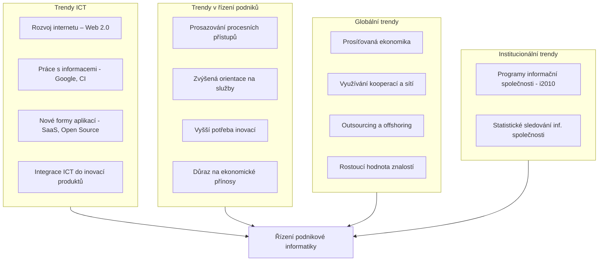

# Digitalizace a inovační trendy v ICT

Tento dokument se zabývá inovačními trendy v oblasti informačních a komunikačních technologií (ICT) a jejich dopady na řízení podnikové informatiky. Vychází z 3. kapitoly knihy *Principy a modely řízení podnikové informatiky*.

## Inovační trendy a jejich vliv

Řízení podnikové informatiky musí reagovat na dynamické změny v technologiích i v byznysu. Následující schéma zobrazuje klíčové oblasti trendů, které formují současné pojetí IT v podnicích.

### Čtyři hlavní oblasti inovačních trendů

---

## Digitální éra a informační společnost

Vývoj ekonomiky lze rozdělit do tří hlavních ér, přičemž každá je charakteristická jiným zaměřením, technologiemi a klíčovými faktory.

### Vývoj ekonomických ér

| Charakteristika | Zemědělská éra | Průmyslová éra | Informační éra |
|-----------------|----------------|----------------|----------------|
| **Ekonomická orientace** | Zemědělství, těžba surovin | Výroba strojů a produktů | **Služby** |
| **Klíčové technologie** | Mechanické nástroje | Motorem poháněné stroje | **ICT** |
| **Životní cyklus výrobku** | Dekády | Roky | **Měsíce** |
| **Příspěvek pracovníka** | Fyzická síla | Fyzická síla / kreativita | **Kreativita** |
| **Dosah vlivu** | Rodina / lokalita | Region / země | **Globální** |

### Šest klíčových ekonomických faktorů

Moderní ekonomická teorie identifikuje šest faktorů, které ovlivňují bohatství národů a podniků. K původním faktorům (Smith, Schumpeter) přidal Peter Drucker faktor **znalostí**, který je v informační éře rozhodující.

1.  **Země** (Adam Smith, 18. století)
2.  **Práce** (Adam Smith)
3.  **Kapitál** (Adam Smith)
4.  **Technologie** (Joseph Schumpeter, 20. století)
5.  **Podnikání** (Joseph Schumpeter)
6.  **Znalosti** (Peter Drucker, konec 20. století)

> **Klíčová myšlenka:** ICT a zejména informace a znalosti rozhodujícím způsobem ovlivňují ekonomické výsledky podniků a mají vliv i na ekonomiku vyspělých zemí.

---

## Digitalizace služeb a produktů

V informační éře jsou nejrychleji rostoucími firmami ty, které se orientují na **digitalizované služby** (např. Google, Amazon, eBay, Facebook).

### Charakteristiky digitalizovaných služeb

1.  **Nespotřebovávají se užitím**: Na rozdíl od fyzických produktů služba jejím poskytnutím nezaniká.
2.  **Nízké náklady replikace a distribuce**: Jakmile je služba vyvinuta, náklady na obsluhu dalšího uživatele jsou marginální.
3.  **Vysoké náklady vývoje**: Většina investic směřuje do počátečního vývoje a infrastruktury.

### Příklady digitalizace v odvětvích

*   **Automobilový průmysl**: GPS navigace, řízení spotřeby, ABS, parkovací asistenti.
*   **Bankovnictví**: Internetové bankovnictví, čipové karty, elektronické transakce.
*   **Logistika**: RFID (Radio Frequency Identification) pro sledování zboží, efektivní řízení skladů.

---

## Web 2.0 a Enterprise 2.0

### Evoluce webu

| Charakteristika | Web 1.0 (cca 1996) | Web 2.0 (cca 2006+) |
|-----------------|--------------------|---------------------|
| **Princip** | Publikování obsahu (Read-only) | Spolupráce a tvorba obsahu (Read-Write) |
| **Role uživatele** | Pasivní konzument | Aktivní tvůrce (Prosumer) |
| **Příklady** | Osobní stránky, katalogy | Wiki, blogy, sociální sítě, YouTube |

### Enterprise 2.0
Pojem **Enterprise 2.0** označuje využití principů a technologií Web 2.0 v podnikovém prostředí.

**Přínosy pro podnik:**
*   **Urychlení rozhodování**: Rychlejší sdílení informací v týmech.
*   **Inovace produktů**: Analýza zpětné vazby zákazníků na sociálních sítích.
*   **Znalostní management**: Využití wiki pro sdílení firemního know-how.
*   **Marketing**: Lepší zacílení reklamy a budování loajality (sociální sítě).

---

## Trendy v užití dat a informací

### Sdílení dat v dodavatelském řetězci (SCM)
Data nejsou izolována v podniku, ale sdílena v celém řetězci (dodavatel-výrobce-prodejce).
*   **Zdroje dat**: Prodeje na pokladnách (POS), historie nákupů, mobilní data, návštěvnost webu.

### Competitive Intelligence (CI)

> **Definice:** Competitive Intelligence je systematický a etický program pro získávání, analyzování a řízení externích informací, které mohou mít vliv na podnikové plány, rozhodování a činnost.

**Cíle CI:**
*   Sledování trendů trhu.
*   Monitorování aktivit konkurence.
*   Včasná identifikace příležitostí a rizik.

---

## Vliv ICT na chování podniků

Přechod od tradičního modelu k modelu adaptabilnímu a prosíťovanému.

### Od hodnotového řetězce k aliancím

| Aspekt | Tradiční společnost | Adaptabilní (prosíťovaná) společnost |
|--------|---------------------|--------------------------------------|
| **Cíl** | Efektivnost, stabilita | **Odlišnost, adaptabilita, rychlost** |
| **Řízení** | Příkaz a kontrola (hierarchie) | **Spojení a spolupráce (sítě)** |
| **Inovace** | Vnitřní výzkum a vývoj | **Otevřené inovace, spolupráce** |
| **Fokus** | Nabídka (Push) | **Poptávka (Pull)** |
| **Paradigma** | Hodnotový řetězec | **Aliance a ekosystémy** |

### Prosíťovaný model podnikání
Podniky se stávají součástí širších sítí (ekosystémů), kde sdílejí:
*   Myšlenky a investice.
*   Rizika.
*   Informace o zákaznících.

**Výzvy:** Nutnost koordinace celé sítě, řízení rizik napříč subjekty a identifikace přidané hodnoty.

---

## Čtyři klíčové efekty ICT na ekonomiku

Podle Carayannise má rozšíření ICT čtyři hlavní dopady:

1.  **Vnitřní účinnost (Internal Efficiency)**
    *   Zvýšení produktivity "bílých límečků" (administrativy).
    *   Automatizace zpracování dokumentů.
    *   Redukce režijních nákladů.

2.  **Transakční náklady (Transaction Costs)**
    *   Snížení nákladů na koordinaci mezi firmami.
    *   Elektronická výměna dat (EDI) eliminuje papírování a zpoždění.
    *   Levnější realizace obchodních vztahů.

3.  **Restrukturalizace (Restructuring)**
    *   Díky nízkým transakčním nákladům není nutné dělat vše "in-house".
    *   Rozvoj outsourcingu, virtuálních týmů a klastrů.
    *   Firmy se mohou zmenšovat a více spolupracovat.

4.  **Znalostní management (Knowledge Management)**
    *   Hodnota firmy stojí na kvalitě procesů a know-how.
    *   Sítě umožňují rychlejší sdílení znalostí a inovací.

---

## Význam ICT pro sektory ekonomiky

Investice do ICT se liší podle odvětví. Některá odvětví jsou na ICT životně závislá (**ICT Driven Industries**).

### Podíl investic do ICT (příkladová data)

| Sektor | Podíl investic do ICT | Charakteristika |
|--------|----------------------|-----------------|
| **Banky a pojišťovny** | ~90 % | ICT je výrobní linkou, výpadek je fatální. |
| **Telekomunikace** | ~89 % | Jádro podnikání je ICT. |
| **Utility (energie)** | ~68 % | Řízení sítí, smart metering. |
| **Školství/Veřejná správa** | ~40-45 % | Podpora výuky, e-Government. |
| **Výroba/Stavebnictví** | ~16 % | CAD/CAM, řízení výroby, ale podíl nižší než u služeb. |

> V "ICT Driven Industries" (banky, telco) je CIO (ředitel IT) obvykle členem představenstva nebo top managementu, protože IT strategie je totožná s podnikovou strategií.

---

## Digitalizace ve veřejné správě (e-Government)

Cílem e-Governmentu je zefektivnit styk občana se státem.

**Prioritní oblasti (příklad ČR - Czech POINT, Datové schránky):**
1.  **Základní registry**: Jediný zdroj pravdy o občanech, firmách a nemovitostech.
2.  **Univerzální kontaktní místa**: Možnost vyřídit věci na jednom místě (fyzicky i elektronicky).
3.  **Zaručená elektronická komunikace**: Bezpečná výměna dokumentů (identita, časová razítka).
4.  **Digitalizace datových fondů**: Převod papírových archivů do digitální podoby.

---

## Shrnutí pro management

Manažeři v digitální ekonomice musí řešit nové výzvy:
*   **Kapitalizace znalostí**: Jak vytěžit hodnotu z toho, co firma ví.
*   **Hyperkonkurence**: ICT snižuje bariéry vstupu na trh, konkurence je globální.
*   **Bezpečnost**: Ochrana dat a transakcí je kritická.
*   **Adaptabilita**: Schopnost rychle měnit procesy a produkty dle zpětné vazby z trhu.
